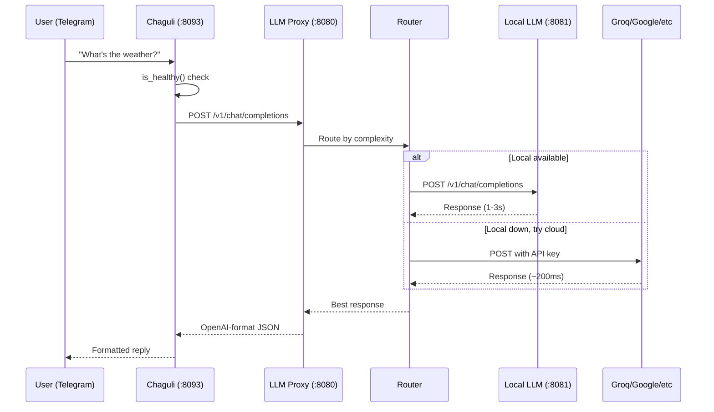
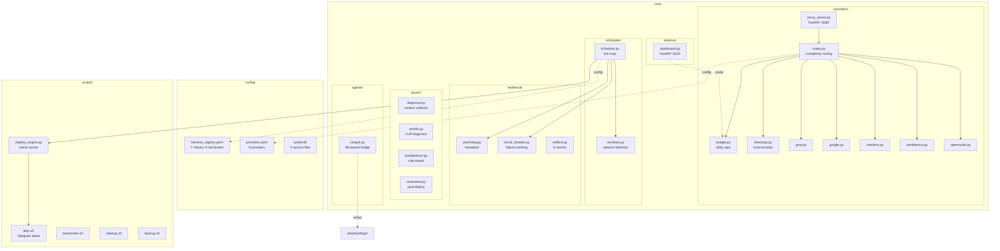
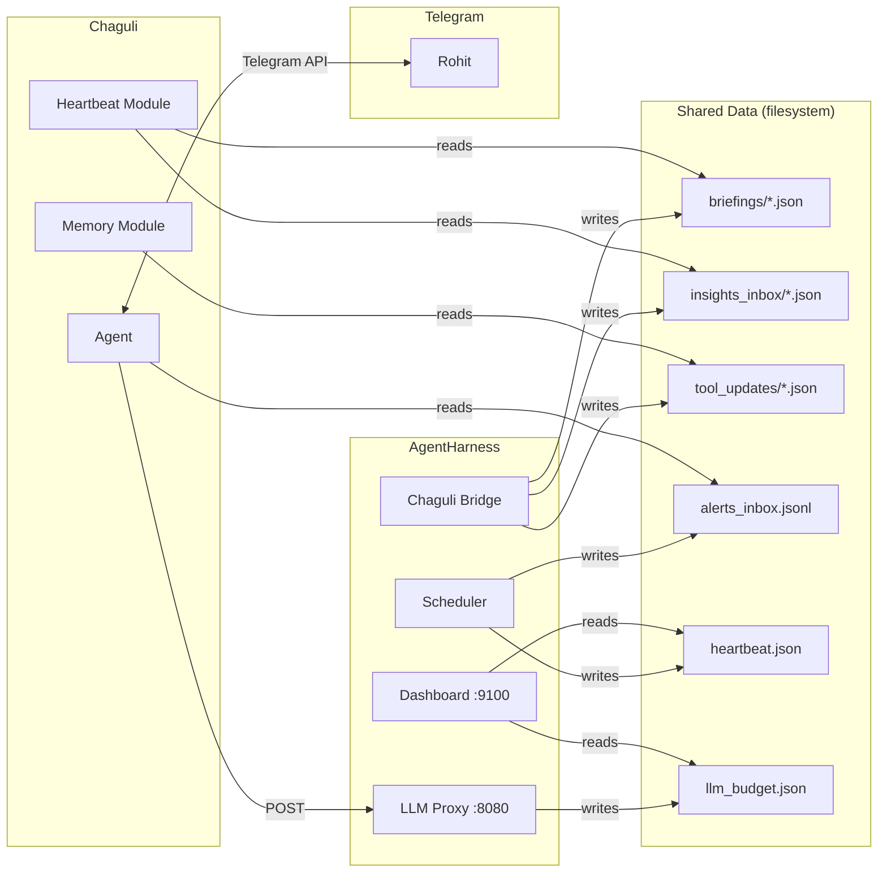
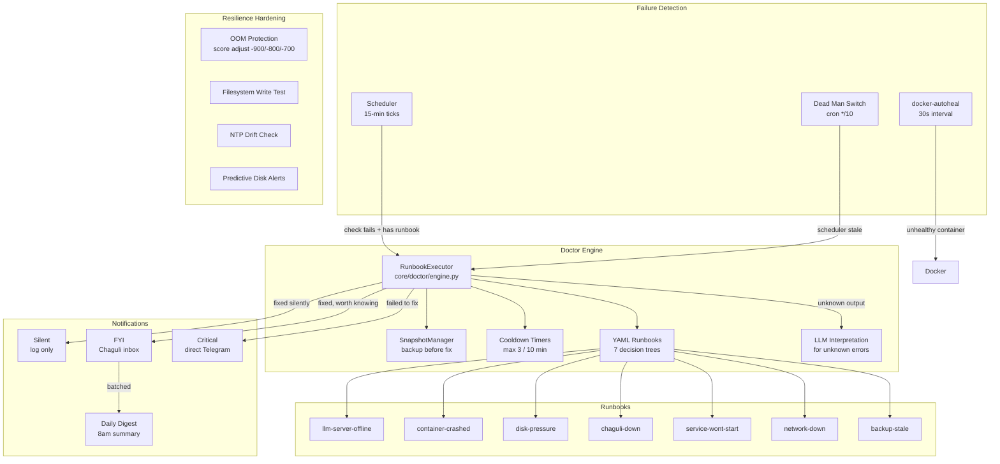

# Homelab Architecture

Generated: 2026-04-10

## 1. System Topology — The Big Picture

Everything running on one HP Laptop (Ryzen 4700U, 36GB RAM, 256GB SSD).

```mermaid
graph TB
    subgraph Internet
        Groq[Groq API]
        Google[Google Gemini]
        Cerebras[Cerebras API]
        SambaNova[SambaNova API]
        OpenRouter[OpenRouter API]
        Telegram[Telegram API]
    end

    subgraph HP_Laptop["HP Laptop — 192.168.29.10"]
        subgraph Systemd["Systemd Services"]
            LLM["ik-llama-server<br/>:8081<br/>Gemma 4 26B-A4B"]
            Proxy["LLM Proxy<br/>:8080<br/>Smart Router"]
            Scheduler["Scheduler<br/>15min ticks"]
            Watchdog["Watchdog<br/>heartbeat monitor"]
            Dashboard["Dashboard<br/>:9100<br/>FastAPI"]
        end

        subgraph Docker["Docker Containers (host network)"]
            Chaguli["Chaguli Agent<br/>:8093<br/>Telegram bot"]
            Gateway["MCP Gateway<br/>:8096"]
            DockerMCP["docker-mcp :8095"]
            FileMCP["file-mcp :8097"]
            N8nMCP["n8n-mcp :8098"]
            PaperlessMCP["paperless-mcp :8099"]
            GitMCP["git-mcp :8100"]
            MediaMCP["media-mcp :8101"]
            BackupMCP["backup-mcp :8102"]
            NetworkMCP["network-mcp :8103"]
            RssMCP["rss-mcp :8104"]
        end

        subgraph Services["Application Containers"]
            N8n["n8n :5678"]
            Paperless["Paperless :8000"]
            Gitea["Gitea :3001"]
            Sonarr["Sonarr :8989"]
            Radarr["Radarr :7878"]
            Lidarr["Lidarr :8686"]
            Jellyfin["Jellyfin :8096"]
            QBit["qBittorrent :8085"]
            PiHole["Pi-hole :8053"]
            Nextcloud["Nextcloud"]
            Vaultwarden["Vaultwarden"]
            UptimeKuma["Uptime Kuma"]
            Homarr["Homarr"]
            Stump["Stump"]
            Portainer["Portainer"]
            NGINXProxy["NGINX Proxy Mgr"]
        end

        subgraph Data["Data Layer"]
            Models["~/models/<br/>57GB GGUF files"]
            AHData["~/agentharness/data/<br/>briefings, budget, state"]
            OCData["~/openclaw/data/<br/>agent state, DB"]
        end
    end

    Chaguli -->|POST /v1/chat/completions| Proxy
    Proxy -->|primary| LLM
    Proxy -->|fallback| Groq
    Proxy -->|fallback| Google
    Proxy -->|fallback| Cerebras
    Proxy -->|fallback| SambaNova
    Proxy -->|fallback| OpenRouter
    Chaguli -->|polling| Telegram
    Scheduler -->|health checks| Proxy
    Scheduler -->|health checks| Gateway
    Watchdog -->|heartbeat| Scheduler
    LLM ---|reads| Models

    Gateway --> DockerMCP
    Gateway --> FileMCP
    Gateway --> N8nMCP
    Gateway --> PaperlessMCP
    Gateway --> GitMCP
    Gateway --> MediaMCP
    Gateway --> BackupMCP
    Gateway --> NetworkMCP
    Gateway --> RssMCP

    N8nMCP --> N8n
    PaperlessMCP --> Paperless
    GitMCP --> Gitea
    MediaMCP --> Sonarr
    MediaMCP --> Radarr
    MediaMCP --> Jellyfin
    MediaMCP --> QBit
```



## 2. LLM Request Flow

How a message goes from Telegram to an LLM response.



## 3. AgentHarness Internal Architecture



## 4. Chaguli Agent Architecture

```mermaid
graph TB
    subgraph Chaguli["Chaguli Agent (Docker container)"]
        subgraph Core["Core"]
            Agent["agent.py<br/>main loop, command router"]
            TG["telegram_handler.py<br/>polling + send"]
            Config["config.yml<br/>all settings"]
        end

        subgraph Clients["clients/"]
            LLMClient["llm_client.py<br/>call_smart, call_with_tools"]
            SearchClient["search_client.py<br/>SearXNG integration"]
        end

        subgraph Domains["domains/"]
            LinkedIn["linkedin.py<br/>/draft command"]
            LinkedInDraft["linkedin_drafter.py<br/>content generation"]
        end

        subgraph Intelligence["Intelligence"]
            Memory["memory.py<br/>fact extraction, turns"]
            Heartbeat["heartbeat.py<br/>infrastructure checks"]
            SelfImprove["self_improve.py<br/>weekly improvement"]
            TaskTracker["task_tracker.py<br/>pending tasks"]
            Tools["tools.py<br/>48 MCP tools"]
        end
    end

    subgraph External["External"]
        Telegram["Telegram API"]
        Proxy["LLM Proxy :8080"]
        MCPGateway["MCP Gateway :8096"]
        SearXNG["SearXNG"]
        AHInbox["AgentHarness<br/>briefings/insights"]
    end

    TG <-->|poll/send| Telegram
    Agent --> TG
    Agent --> LLMClient
    Agent --> Memory
    Agent --> Tools
    Agent --> Heartbeat

    LLMClient -->|chat/tools| Proxy
    Tools -->|48 tools| MCPGateway
    SearchClient --> SearXNG
    Heartbeat -->|reads| AHInbox

    Agent --> LinkedIn
    LinkedIn --> LinkedInDraft
```



## 5. Data Flow Between Systems



## 6. Port Map

| Port | Service | Type |
|------|---------|------|
| 3001 | Gitea | App |
| 5678 | n8n | App |
| 8000 | Paperless | App |
| 8053 | Pi-hole | App |
| 8080 | **LLM Proxy** | AgentHarness |
| 8081 | **ik-llama-server** | AgentHarness |
| 8085 | qBittorrent | App |
| 8093 | **Chaguli** | Agent |
| 8095 | docker-mcp | MCP |
| 8096 | **MCP Gateway** | MCP |
| 8097 | file-mcp | MCP |
| 8098 | n8n-mcp | MCP |
| 8099 | paperless-mcp | MCP |
| 8100 | git-mcp | MCP |
| 8101 | media-mcp | MCP |
| 8102 | backup-mcp | MCP |
| 8103 | network-mcp | MCP |
| 8104 | rss-mcp | MCP |
| 8686 | Lidarr | App |
| 7878 | Radarr | App |
| 8989 | Sonarr | App |
| 9100 | **Dashboard** | AgentHarness |

## 7. Health Check Registry

| Check | Type | What | Threshold | Auto-Heal Runbook |
|-------|------|------|-----------|-------------------|
| disk_usage | threshold | `df /` | warn 80%, crit 90% | disk-pressure |
| ram_usage | threshold | `free` | warn 85%, crit 95% | — |
| swap_usage | threshold | `free -m` | warn 500MB, crit 2000MB | — |
| cpu_temperature | threshold | `sensors` | warn 80C, crit 90C | — |
| llm_server | http_probe | `curl :8080/health` | — | llm-server-offline |
| llm_local | http_probe | `curl :8081/health` | — | llm-server-offline |
| docker_unhealthy | command_output | `docker ps --filter health=unhealthy` | non-empty = alert | — |
| docker_crashed | command_output | `docker ps -a --filter status=exited` | non-empty = alert | container-crashed |
| chaguli_container | command_exit | `docker inspect chaguli` | not running | chaguli-down |
| network_health | command_exit | `ping 8.8.8.8` | unreachable | network-down |
| backup_freshness | command_exit | recent files on /mnt/usb | none in 48h | backup-stale |
| filesystem_writable | command_exit | touch test file | write fails | — (escalate) |
| time_drift | command_exit | NTP sync check | >120s drift | — (escalate) |
| disk_trend | command_exit | growth rate projection | full in <14 days | — (alert) |

## 8. Scheduled Harnesses

| Harness | Window | Frequency | Script |
|---------|--------|-----------|--------|
| weekly_optimize | online | weekly | weekly_optimize.sh |
| cleanup | offline | 3d | cleanup.sh |
| benchmark | offline | weekly | benchmark.sh |
| backup | offline | daily | backup.sh |
| security_audit | offline | weekly | security_audit.sh |
| trend_projections | offline | 6h | trend_projector.sh |
| update_watcher | online | weekly | update_watcher.sh |
| mcp_gateway | offline | 6h | mcp_gateway.sh |
| daily_digest | online | daily (7-8am) | send_daily_digest.sh |

## 9. Homelab Doctor — Self-Healing Engine



## 10. Resilience Layers

```
Layer 0 (no intelligence):  systemd Restart=always + docker-autoheal + dead man cron
Layer 1 (rule-based):       YAML runbooks — deterministic decision trees
Layer 2 (LLM-assisted):     Local LLM interprets unknown log output
Layer 3 (human):             Telegram escalation when all else fails
```

| Layer | Handles | Dependencies | Can fail if |
|-------|---------|-------------|-------------|
| 0 | Process died | systemd, cron | Host kernel panic |
| 1 | Known failures | Python, YAML | AgentHarness dead (Layer 0 restarts it) |
| 2 | Unknown failures | LLM + Layer 1 | LLM dead (Layer 1 handles that) |
| 3 | Everything else | Telegram + human | You're asleep (daily digest catches it) |

## 11. CLI Tools

| Command | What |
|---------|------|
| `python3 scripts/doctor_check.py` | Full status report (services, disk, RAM, runbooks) |
| `python3 scripts/doctor_check.py --fix RUNBOOK` | Run a specific runbook |
| `python3 scripts/doctor_check.py --json` | Machine-readable status |
| `python3 scripts/show_logs.py SERVICE` | Show recent logs for any service |
| `python3 scripts/disk_trend.py` | Record disk usage, predict growth |
| `python3 -m core.doctor.engine RUNBOOK --dry-run` | Test runbook without executing |
| `bash scripts/deadman_check.sh` | Check scheduler heartbeat (cron) |
